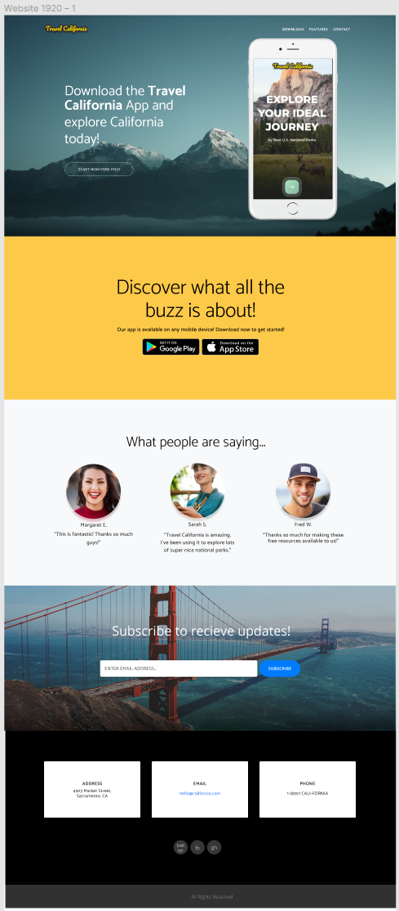

# Travel California Website

## Summary

In this activity, I reviewed a creative brief, and coded a webpage for Travel Calfiornia using Boostrap 4, HTML, and CSS.

## Client Brief

TRAVEL CALIFORNIA

Hello, we are Travel California and we need a website developer to bring our vision of our new webpage to life. Our in-house designer did a pretty good job, but feel free to tweak our design if you feel like you have ideas that can make us better. 

We like:
- Strong, legible fonts.
- Clear, well-defined sections.
- Lifestyle imagery that shows off the sights and scenery of California. The imagery must be crisp and make our viewers want to explore California.

Ways you can contribute:
- Many of our sections could use extra UI elements or features. Everything looks nice, but we wouldn’t mind more ways to interact with the webpage.
- Color scheme: If you want to explore another color palette, feel free! But try to stick to the style we have laid out in the design.
- Our typography looks nice, but we are always open to other suggestions. Maybe you can add a font that feels more... adventurous? 

Your final solution should look similar to this:

## Links

Live application: https://zaitken1.github.io/travel-california/
